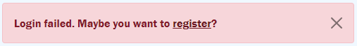

## **Welcome to Shoutout**
### **What is it?**
I started this project for my CS50 2021 Final Project, and the purpose of the website application I made was to send and receive messages between two users. To be frank, *Shoutout* isn't supposed to replace WhatsApp, Viber, Telegram, and other chat-based applications. *Shout out* is, in fact, not made to be like a chat - it lacks functions such as replying, mentioning, stories, and anything else that defines a social media platform.

*Shoutout* is, in its current state, more of a memo app, where users exchange fairly short messages (maximum of 100 characters per message) to exchange important and quick-to-the-point information. Use in a business, organisation, hospital, whatever you like. Of course there is much to improve still in this version of *Shoutout*, especially in the aspect of being user-friendly and perhaps more time-saving functions. Nevertheless, I am still proud of this small project, which also has so much potential for me to continue working on.

## **Taking a look inside**
- ### **`app.py`**
Below the various imports, the first real code you will see this:
```py
db = SQL("sqlite:///data.db")

app = Flask(__name__)
app.config['SESSION_TYPE'] = 'filesystem'
app.secret_key = "secret_key here"
```
For *Shoutout*, I used CS50's library called `SQL`, so that I could easily execute `sqlite3` commands within `data.db`.
- #### **Flask Tables**
```py
class Contacts(Table):
    classes = ["table table-striped"]
    thead_classes = ["table-dark"]
    id = Col('User ID', show=False)
    fname = Col('First name')
    sname = Col('Surname')
    username = Col('Username')
    bdate = Col('Birth Date')
    send = LinkCol('Send', 'sendto', url_kwargs=dict(username='username', id='id'))
```
For this project I needed dynamic tables to list the users available and to show messages sent and received, so I used [Flask Tables](https://flask-table.readthedocs.io/). First, you make a `class` like shown above. Each column of the table created is a `Col` object. The first two variables, `classes` and `thead_classes`, are used to implement Bootstrap 5 CSS classes. They are the equivalent of writing:
```html
<table class="table table-striped">
    <thead class="table-dark">
```
`Messages` class is essentially the same thing but for a different purpose. While `Contacts` is used to list all users in `contacts.html`, the following class `Messages` is used to present the user with messages they sent and received.
- #### **`reqlogin` decorator**
```py
def reqlogin(f):
    @wraps(f)
    def decorated_function(*args, **kwargs):
        if session.get("user_id") is None:
            return redirect("/login")
        return f(*args, **kwargs)
    return decorated_function
```
This is a slightly altered `@login_required` decorator you can find [here](https://flask.palletsprojects.com/en/2.0.x/patterns/viewdecorators/#login-required-decorator). What this `reqlogin` does, is redirect a user who tries to access a page like `contacts.html` to the `login.html` page, only if they are not yet logged in.

Speaking of logging in...
- #### **`login()`**
```py
@app.route('/login', methods=["GET", "POST"])
def login():
    session.clear()
    err = False
    if request.method == "POST":
        rows = db.execute("SELECT * FROM users WHERE username = ?", request.form.get("uname"))
        
        if len(rows) != 1 or not check_password_hash(rows[0]["hash"], request.form.get("password")):
            err = True
        
        if err:
            return render_template("login.html", err=err)

        session["user_id"] = rows[0]["id"]

        return redirect("/")
    else:
        return render_template("login.html", err=err)
```
This is the code that logs in a user. It is, of course, very similar to what I did in `finance.py` in Week 9. First, `rows` is used to check if the username or password inputted exists. A small difference to my old `finance.py` function is that I added the `err` boolean, and passed it to `login.html` like this:
```html

    <div class="alert alert-danger alert-dismissible fade show">
        <button type="button" class="btn-close" data-bs-dismiss="alert"></button>
        <strong>Login failed.</strong> Maybe you want to <a href="/register" class="alert-link">register</a>?
    </div>

```
so that if the user inputs the wrong username or password they will get the following dismissable alert:



I also had no need to check whether the user inputted a username or password, as Bootstrap can do that already:
```html
<div class="invalid-feedback">Please fill out this field.</div>
```
Finally, if everything goes well, the user's `id` is stored in `session["user_id"]`. Then he is redirected to `contacts.html`.

But what if the user has to register?
- #### **`register()`**