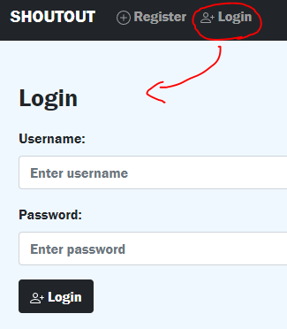
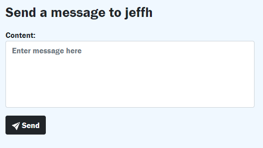
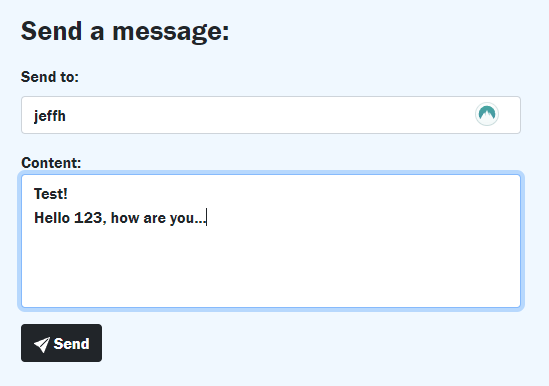
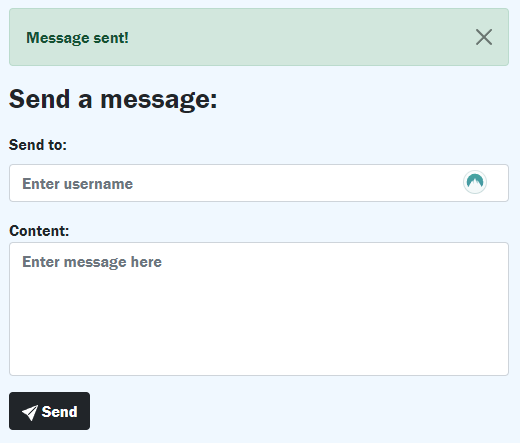
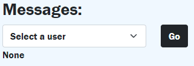
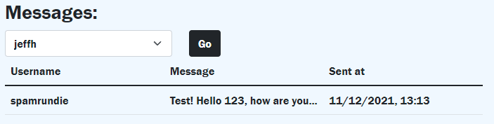
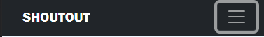

## **Welcome to Shoutout**
### **What is it?**
I started this project for my CS50 2021 Final Project, and the purpose of the website application I made was to send and receive messages between two users. To be frank, *Shoutout* isn't supposed to replace WhatsApp, Viber, Telegram, and other chat-based applications. *Shout out* is, in fact, not made to be like a chat - it lacks functions such as replying, mentioning, stories, and anything else that defines a social media platform.

*Shoutout* is, in its current state, more of a memo app, where users exchange fairly short messages (maximum of 100 characters per message) to exchange important and quick-to-the-point information. Use in a business, organisation, hospital, whatever you like. Of course there is much to improve still in this version of *Shoutout*, especially in the aspect of being user-friendly and perhaps more time-saving functions. Nevertheless, I am still proud of this small project, which also has so much potential for me to continue working on.

## **Taking a look inside**
---
- ### **`app.py`**
Below the various imports, the first lines of code you will see is this:
```py
load_dotenv()
db = SQL("sqlite:///data.db")
app = Flask(__name__)
app.config['SESSION_TYPE'] = 'filesystem'
app.secret_key = os.environ.get("SECRET_KEY")
```
Flask requires a `SECRET_KEY`, so this is where `dotenv` came in handy.\
I then used CS50's library called `SQL`, so that I could easily execute `sqlite3` commands within `data.db`.

---
- #### **Flask Tables**
```py
class Contacts(Table):
    classes = ["table table-striped"]
    thead_classes = ["table-dark"]
    id = Col('User ID', show=False)
    fname = Col('First name')
    sname = Col('Surname')
    username = Col('Username')
    bdate = Col('Birth Date')
    send = LinkCol('Send', 'sendto', url_kwargs=dict(username='username', id='id'))
```
For this project I needed dynamic tables to list the users available and to show messages sent and received, so I used [Flask Tables](https://flask-table.readthedocs.io/). First, you make a `class` like shown above. Each column of the table created is a `Col` object. The first two variables, `classes` and `thead_classes`, are used to implement Bootstrap 5 CSS classes. They are the equivalent of writing:
```html
<table class="table table-striped">
    <thead class="table-dark">
```
`Messages` class is essentially the same thing but for a different purpose. While `Contacts` is used to list all users in `contacts.html`, the following class `Messages` is used to present the user with messages they sent and received.
- #### **`reqlogin` decorator**
```py
def reqlogin(f):
    @wraps(f)
    def decorated_function(*args, **kwargs):
        if session.get("user_id") is None:
            return redirect("/login")
        return f(*args, **kwargs)
    return decorated_function
```
This is a slightly altered `@login_required` decorator you can find [here](https://flask.palletsprojects.com/en/2.0.x/patterns/viewdecorators/#login-required-decorator). What this `reqlogin` does, is redirect a user who tries to access a page like `contacts.html` to the `login.html` page if they are not yet logged in.

Speaking of logging in...

---
- #### **`login`**
```py
@app.route('/login', methods=["GET", "POST"])
def login():
    session.clear()
    err = False
    if request.method == "POST":
        rows = db.execute("SELECT * FROM users WHERE username = ?", request.form.get("uname"))
        
        if len(rows) != 1 or not check_password_hash(rows[0]["hash"], request.form.get("password")):
            err = True
        
        if err:
            return render_template("login.html", err=err)

        session["user_id"] = rows[0]["id"]

        return redirect("/")
    else:
        return render_template("login.html", err=err)
```
This is the code that logs in a user. It is, of course, very similar to what I did in `finance.py` in Week 9. First, `rows` is used to check if the username or password inputted exists. A small difference to my old `finance.py` function is that I added the `err` boolean, and passed it to `login.html` like this:
```html

    <div class="alert alert-danger alert-dismissible fade show">
        <button type="button" class="btn-close" data-bs-dismiss="alert"></button>
        <strong>Login failed.</strong> Maybe you want to <a href="/register" class="alert-link">register</a>?
    </div>

```
so that if the user inputs the wrong username or password they will get the following dismissable alert:


I also had no need to check whether the user inputted a username or password, as Bootstrap can do that already:
```html
<div class="invalid-feedback">Please fill out this field.</div>
```
Finally, if everything goes well, the user's `id` is stored in `session["user_id"]`. Then he is redirected to `contacts.html`.

But what if the user has to register?

---
- #### **`register`**
The register function is similar but slightly more complicated than `login`. Like `login`, I use the `err` variable, but now it must also check if the user has properly inputted username and password, following the rules.

A user can only register if:

- `fname` has more than 1 character.
- `sname` as more than 2 characters.
- `age` must be between `1900-01-01` and `2008-01-01`.
- `pw` matches with `request.form.get("confirmation")`.
- `username` has more than 4 characters.
- `pw` must have at least:
  - 8 characters.
  - a digit.
  - and a capital letter.
```py
if len(pw) < 8 or any(s.isdigit() for s in pw) == False or any(s.isupper() for s in pw) == False:
    return render_template("register.html", alert="Password must have at least 8 characters, one number, and one capital letter.")
```
If any of these rules are not respected when clicking `Register`, they will be met with an alert similar to the one in `login`. The alert's message is passed through `alert` in `render_template()`.

If the user is able to register properly, the following code will add them to `data.db`:
```py
db.execute("INSERT INTO users (fname, sname, bdate, username, hash) VALUES(?, ?, ?, ?, ?)", fname, sname, request.form.get("age"), uname, generate_password_hash(pw))
```
As you can see, the user's first name, surname, birth date, username, and password are stored in `data.db`. Now they can log into the website by clicking 'Login' in the `navbar` and filling out username and password.



---

- #### **`contacts`**
Once the user logs into *Shoutout*, they will first be redirected to `contacts.html`. This is where the user will see the table `Contacts(Table)` listing all users who are registered in *Shoutout*, ordered alphabetically.
```py
def contacts():
    qry = db.execute("SELECT * FROM users WHERE id != ? ORDER BY fname ASC;", session["user_id"])
    contacts = Contacts(qry)
    return render_template('contacts.html', table=contacts)
```
I first run `qry` which returns all users ordered alphabetically that don't have the same `id` as the logged user. Then `qry` is passed into `Contacts(Table)` to create all of the `Col` objects needed.
```html

<div class="container">
    <h3>Contacts:</h3>
    {{ table }}
</div>

```
You might be wondering what `LinkCol` (in the `Contacts` class) means. It is similar to a `Col` object as it has it's own header ('Send'), but in each row *`send`* is a link to `sendto.html`:


When you click `Send`, you will be redirected to `sendto.html` where you can write a message to the user who shared the same row as the 'Send' you clicked:



How does this work?

---
- #### **`sendto`**
Let's take a look at the last line of `Contacts`:
```py
send = LinkCol('Send', 'sendto', url_kwargs=dict(username='username', id='id'))
```
`LinkCol` takes in a few arguments. `'sendto'` is the 'endpoint'; where the link will take you. `url_kwargs` is needed to take `username` and `id` as arguments. What this means is that it will redirect you to a link that looks like the `@app.route` below.

Once you click 'Send', you will be sent to (in this case): *`/sendto/jeffh4`*. *`jeffh`* is the username that was passed to `url_kwargs` earlier, and *`4`* is jeffh's `id` that was passed with that username.

Once you write whatever message you like and click the 'Send' button, the following code will run:
```py
@app.route('/sendto/<string:username><int:id>', methods=['GET', 'POST'])
@reqlogin
def sendto(username, id):
    if request.method == "POST":
        user = db.execute("SELECT username FROM users WHERE id = ?", session["user_id"])
        content = request.form.get("msg")
        db.execute("INSERT INTO messages (sender, receiver_id, content, date) VALUES(?, ?, ?, ?)", user[0]['username'], id, content, time.time())
        
        return render_template("/sendto.html", user=username, alert="Message sent!")
    else:
        return render_template("/sendto.html", user=username)
```
Under `if request.method == "POST":` (which becomes true once you press Send), *`user`* is the logged in user's username and *`content`* is be the message that was written and to be sent. To finally send the message, `sender` (logged user's username), `receiver_id` (jeffh's id), `content` (the message), and `time.time()` (current epoch time) are stored in the `messages` table in `data.db`.

The reason why I use epoch time instead of a normal date like '2021-12-10 10:32:55' is because it is easier to sort `Messages` (in `messages.html`) by time when using a number. Of course in `messages.html` `time.time()` will be converted back to a readable date.

---
- #### **`sendto`**
There is a different yet very similar way to send a message to a user. Instead of finding someone in `contacts.html`, if you know their username already, you could click 'Send' (next to 'Contacts' in the `navbar`). In our case we know Jeff Harold's username to be `jeffh` (it might be useful in an organisation to have everyone's username to be, for example, their first name and then their surname's initial for convenience), so we fill the 'Send to:' field with his username and 'Content:' with our message.



*Ignore the NordPass icon in the 'Send to:' field...*

Once we click 'Send', this happens:
```py
if request.method == "POST":
    user = db.execute("SELECT username FROM users WHERE id = ?", session["user_id"])
    receiver = db.execute("SELECT id FROM users WHERE username = ?", request.form.get("uname"))
    content = request.form.get("msg")
    db.execute("INSERT INTO messages (sender, receiver_id, content, date) VALUES(?, ?, ?, ?)", user[0]['username'], receiver[0]['id'], content, time.time())
    
    return render_template("/send.html", alert="Message sent!")
```
As you can see, the code is the same as `sendto()`. You might have noticed the `alert` variable I am passing to `send.html`; it is similar to when we fail a log in attempt in `login.html`:



---
- #### **`messages`**

This is the last function in `app.py`. If you click 'Messages' in the `navbar`, you will be sent to `messages.html`, which looks like this:



First, you must select a user from the dropdown menu, the click Go. Afterwards you will be presented with a table that lists all the messages you sent to and received from that user.



We can see our previous message! If jeffh responds, we will see that too. Of course the table is ordered by time, and the latest message sent or received by a user will come first.

```py
def messages():
    if request.method == "POST":
        loggedusername = db.execute("SELECT username FROM users WHERE id = ?", session["user_id"])
        users = db.execute("SELECT username FROM users WHERE id IN (SELECT receiver_id FROM messages WHERE sender = ?) OR (SELECT sender FROM messages WHERE receiver_id = ?)", loggedusername[0]['username'], loggedusername[0]['username'])
        username = request.form.get("select")
        if username == 'Select a user':
            return render_template("/messages.html", table=None, users=users)
        
        userid = db.execute("SELECT id FROM users WHERE username = ?", username)
        qry = db.execute("SELECT * FROM messages WHERE (receiver_id = ? AND sender = ?) OR (receiver_id = ? AND sender = ?) ORDER BY date DESC", userid[0]['id'], loggedusername[0]['username'], session["user_id"], username)
        messages = Messages(qry)
        
        return render_template("/messages.html", table=messages, users=users)
    else:
        users = db.execute("SELECT username FROM users WHERE id != ?", session["user_id"])
        
        return render_template("/messages.html", table=None, users=users)
```
Above is the code that shows us the messages. `loggedusername` gets the logged user's username, while `users` are the people to who we sent a message before (which will appear in the dropdown menu). Then `username` is what we selected from the menu.
If `username` is it's default value ('Select a user') then the table should return nothing. If instead, we do select someone from the menu, then `userid` will get our `id`, and finally `qry` finds every message that our user received from or sent to whoever we selected in the dropdown menu. Finally, `qry` is passed to `Messages()` to create the table we need, which is shown to us in `messages.html`.

---
- ### **`layout.html` and `styles.css`**

`layout.html` is what each page in *Shoutout* has in common.

```html
<meta name="viewport" content="initial-scale=1, width=device-width">
```
The line of code above helps to make the website mobile-friendly.

First, I import both Bootstrap 5 and its icons, then `styles.css`. Bootstrap was extremely useful when making the website as it offers various buttons, alerts, containers, tables, etc. that look good and have great functionality.

```html
<link href="https://cdn.jsdelivr.net/npm/bootstrap@5.1.3/dist/css/bootstrap.min.css" rel="stylesheet" integrity="sha384-1BmE4kWBq78iYhFldvKuhfTAU6auU8tT94WrHftjDbrCEXSU1oBoqyl2QvZ6jIW3" crossorigin="anonymous">
<link rel="stylesheet" href="https://cdn.jsdelivr.net/npm/bootstrap-icons@1.7.1/font/bootstrap-icons.css">
<!-- At the end of <body>:-->
<script src="https://cdn.jsdelivr.net/npm/bootstrap@5.1.3/dist/js/bootstrap.bundle.min.js" integrity="sha384-ka7Sk0Gln4gmtz2MlQnikT1wXgYsOg+OMhuP+IlRH9sENBO0LRn5q+8nbTov4+1p" crossorigin="anonymous"></script>
```
I then set the title (which changes depending on what page you're on) and the website icon to appear next to the title.

Now we dive into the `<body>` of each page. First:
```html
<nav class="navbar navbar-expand-sm bg-dark navbar-dark">
```
This defines the Bootstrap navigation bar that people use to navigate the website.
```html
<a class="navbar-brand" href="/">SHOUTOUT</a>
```
Above, we have the brand name inside the `navbar` which is also a link to the home page (`contacts.html`).

For phones and small screens, the navigation bar can collapse into a button like this:



Using Jinja logic, I can tell the website to only show Contacts, Send, Messages, and Logout if the user is logged in: ``.
Else (or better, ``) the only links you can navigate to are Register and Login.

To use Bootstrap icons in links and buttons, I choose what icon to use from [here](https://icons.getbootstrap.com/). Then you simply copy the HTML it gives you and you can use it wherever you want.

```html
<main class="container p-5">
    
    
</main>
```
Here is what makes each page different. Buttons, menus, tables, etc. are inside the `<main>` of this layout.